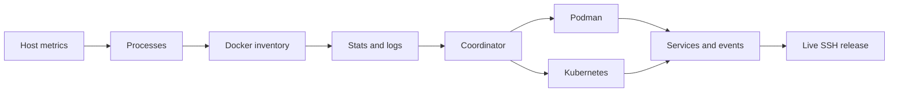

# Your collector roadmap

**Learning target: understand one host metric, one process, and one Docker container from SDK to screen.**
Build one source at a time. Keep the demo runnable as your visual reference.
Each numbered stage is a small milestone you can finish and commit separately;
there is no deadline attached to it.

The project now ships working collectors in `src/sshuptime/live.py`,
`src/sshuptime/engines.py`, and `src/sshuptime/kubernetes.py`. Use these
stages as exercises for learning, testing, and extending them.
Advanced UI ideas are specified in [DESIGN.md](DESIGN.md), not implemented yet.

## Starting map

| File | What you do here |
| --- | --- |
| `src/sshuptime/models.py` | Read `Resource`, `Snapshot`, and `Collector`; keep these your UI boundary |
| `src/sshuptime/collectors.py` | Keep the demo; use it as an example of the shape the UI expects |
| `src/sshuptime/engines.py` and `kubernetes.py` | Study injected source settings and runtime strategies |
| `src/sshuptime/live.py` | Study `LiveCollector.snapshot()` and its loop over runtime strategies |
| `src/sshuptime/presentation.py` | Map resource fields into injected columns and inspector modes |
| `tests/test_*_collector.py` | Test mapping and failure behavior with small fake SDK responses |
| `src/sshuptime/__init__.py` | Later, add an explicit `live` command alongside `demo` |
| `src/sshuptime/ssh.py` | Later, switch the session child from `demo` to `live` |

Keep Textual imports out of runtime strategies. Return validated `Resource`
models and keep each SDK call behind its owning strategy.

### Contract rules to decide first

- Stable IDs: engine ID for containers; Kubernetes UID for cluster resources;
  PID plus process creation time for processes. Names alone can be reused.
- Host CPU, memory, and disk meters are percentages in the range 0–100.
  Document whether per-process/container CPU means one-core utilization or
  machine-wide utilization; those two measures aren't interchangeable.
- `memory` is currently a display string; keep raw bytes in the manifest if useful.
- Normalize health into the existing UI vocabulary: `running`, `active`, `ready`,
  `mounted`, `stopped`, `sleeping`, `crashed`, `failed`, `error`, `notready`,
  `unhealthy`. Keep the exact engine status/reason in the manifest.
- Unknown metrics must not silently become zero. The current numeric fields have
  no unknown state: agree on nullable values and UI rendering before wiring sources
  that cannot supply them. Meanwhile, return an unavailable label for string fields
  and retain the last successful host snapshot on host collection failure.
- `manifest` must be JSON serializable. No SDK objects, bytes, or datetime objects.
- `logs` is a bounded tail snapshot. `events` contains **new observations only**.

## 0 · Run the reference

- [ ] Run `uv sync` and `uv run sshuptime`.
- [ ] Try `/`, `e`, `s`, Space, a row click, Logs, and JSON.
- [ ] Press `t` and try a light theme as well as a dark one.
- [ ] Read the Pydantic resource/snapshot models and collector protocols in `models.py`.
- [ ] Create a small scratch script for SDK experiments.

**Done when:** you can explain how one `Resource` reaches the table and inspector.

## 1 · Real host summary

**Learn:** [psutil's system APIs](https://psutil.io/). Add it with `uv add psutil`.

- [ ] In a scratch script, print hostname, boot time, CPU percentage, RAM usage,
  and disk usage for a chosen mount point.
- [ ] Trace `SystemCollector._read_host()`; reuse sampling state between refreshes.
- [ ] Take non-blocking CPU samples across intervals; don't interpret the initial
  warm-up sample as a reliable measurement.
- [ ] Format uptime from boot time and the current clock.
- [ ] Return a `Snapshot` with real summary metrics and an empty inventory.
- [ ] Launch `UptimeApp(your_collector)` from your scratch script.

**Done when:** the top meters show your machine, update repeatedly, and agree
reasonably with a host monitor. A collection error becomes STALE, not fake zeroes.

## 2 · Processes that come and go

- [ ] Enumerate PID, creation time, command/name, username, state, CPU, and RSS.
- [ ] Map results to `inventory['Processes']['Processes']`.
- [ ] Reuse process sampling objects as needed for interval CPU measurements.
- [ ] Handle a process disappearing between enumeration and inspection.
- [ ] Handle access-denied processes without failing the entire snapshot.
- [ ] Put PID/user in `info` and structured fields in `manifest`.
- [ ] Test PID reuse and a process disappearing during collection.

**Done when:** starting/exiting a process changes the table, CPU sort works, and
selecting a row keeps following the same process across updates.

**Keep small:** process trees and container ownership links come later.

## 3 · Docker inventory, including stopped containers

**Learn:** [Docker's container API](https://docker-py.readthedocs.io/en/stable/containers.html).
Add `uv add docker`.

- [ ] Connect and perform a small API request in a scratch script.
- [ ] Distinguish engine absent, permission denied, and temporarily unreachable.
- [ ] Fetch all containers, including stopped ones, and map stable IDs/names/states.
- [ ] Add `inventory['Docker']['Containers']` only after a successful probe.
- [ ] Add inspect data as a JSON-safe manifest; redact secret environment values
  before including them in a monitor that other users can access.
- [ ] Execute blocking SDK work with `asyncio.to_thread()` and SDK timeouts.
- [ ] Close the SDK client when collection ends.

**Done when:** running, stopped, and failed containers appear correctly, and missing
Docker doesn't prevent host/process data from loading.

## 4 · Docker stats, logs, networks, and volumes

- [ ] Fetch bounded, one-shot stats; compare two samples where CPU needs deltas.
- [ ] Handle stopped containers and missing stats explicitly.
- [ ] Fetch a bounded log tail; decode bytes and preserve multiline content.
- [ ] Add Networks and Volumes categories with stable IDs and inspect manifests.
- [ ] Limit concurrent SDK calls so many containers don't create unlimited work.
- [ ] Test a container being deleted while stats/logs are being fetched.

**Done when:** selecting a container shows matching inspect data/logs; the dashboard
stays responsive with multiple containers and failed requests.

**Keep small:** short bounded log tails are enough here. On-demand log collection
needs a later selection API; the current collector receives no selected-resource ID.

## 5 · One coordinator, independent failures

- [ ] Trace `LiveCollector.snapshot()` and add one injected runtime strategy.
- [ ] Run independent adapters concurrently with bounded timeouts.
- [ ] Retain the last successful result separately for each source.
- [ ] Prevent overlapping work, including timed-out blocking threads: cancelling
  `to_thread()` does not stop the underlying SDK operation.
- [ ] Keep established runtime tabs during a transient outage; do not make a
  disconnected engine look like an engine that was never installed.
- [ ] Emit one failure transition and one recovery transition, not an error per tick.
- [ ] Test one failing engine while another source continues updating.

**UI handoff:** source-specific stale badges and unknown numeric metrics require a
small contract/UI extension (see DESIGN.md). Until then, identify cached source
results with explicit stale context plus an event; don't label cached rows healthy
without telling the viewer they are stale. The existing STALE banner is global.

**Done when:** an engine outage leaves its last known inventory visibly stale while
processes continue updating, and recovery clears that state.

## 6 · Podman parity

**Learn:** [Podman Python SDK](https://podman-py.readthedocs.io/en/latest/).
Add `uv add podman` when ready.

- [ ] Connect to a configured Podman service/socket; test rootless access.
- [ ] Repeat the containers → inspect → stats/logs → networks/volumes progression.
- [ ] Share mapping helpers only when the two SDK payloads actually agree.
- [ ] Keep Docker and Podman IDs scoped by runtime.
- [ ] Treat unavailable sockets and permission errors as source status.

**Done when:** either engine can work alone, both can work together, and disabling
one does not change the other's inventory.

## 7 · Kubernetes inventory before watches

**Learn:** [kubernetes-asyncio](https://kubernetes-asyncio.readthedocs.io/en/latest/).
Add `uv add kubernetes-asyncio` when ready.

- [ ] Load a selected kubeconfig/context and list pods in one namespace.
- [ ] Add nodes and services once pods work.
- [ ] Use API serialization helpers to obtain JSON-safe manifests.
- [ ] Derive health from conditions, container states, and restart reasons; pod
  phase alone does not describe all failures, such as a restart backoff.
- [ ] Add bounded pod logs with explicit container choice for multi-container pods.
- [ ] Treat forbidden namespaces and missing metrics APIs as unavailable data.
- [ ] Add namespace/context configuration before attempting a UI switcher.
- [ ] Once polling works, explore watches, reconnects, and relisting after expiry.

**Done when:** pending, healthy, and failing pods are distinguishable; a forbidden
request does not erase previously collected cluster data or block host metrics.

## 8 · Services and useful events

- [ ] Add a Linux systemd adapter for loaded service units and failed states.
- [ ] Use structured output or a structured API where possible; if invoking a
  command, use `asyncio.create_subprocess_exec`, a timeout, and fixed arguments.
- [ ] Handle hosts without systemd and journal access without permission.
- [ ] Add bounded recent service logs.
- [ ] Compare snapshots to detect state transitions and restart count changes.
- [ ] Attach timestamps and resource IDs to events in your internal model.
- [ ] Deduplicate events and bound retained history.

**Done when:** a service failure creates one relevant event and leads to matching
service details/logs. Repeated identical snapshots don't flood the event stream.

## 9 · A real local and SSH release

- [ ] Add an explicit `live` CLI command constructing your coordinator.
- [ ] Keep `demo` separate and clearly labeled; never fall back to simulated data
  after real collection fails.
- [ ] Wire SSH sessions to the intended live command, with a documented demo option.
- [ ] Test valid/invalid keys, resize, disconnect, and reconnect.
- [ ] Check SDK/client cleanup when the app quits or SSH disconnects.
- [ ] Run `uv run pytest` and Ruff checks, then manually verify on a test server.
- [ ] Verify missing engines, permission denial, log volume, and narrow terminals.

**Done when:** SSH opens real server telemetry, changing infrastructure updates the
screen, failures remain visible, and closing a session leaves no collector behind.

**Later:** multiple viewers currently start separate child processes. Sharing a
collector requires a service/cache and IPC; an in-memory singleton won't share data
between those processes.

## 10 · Cron inventory and launch history

The reference implementation is in `src/sshuptime/cron.py`. Use it to learn how
scheduled jobs differ from service logs.

- [ ] Inspect your own `crontab -l` and one readable `/etc/cron.d` file; identify
  the extra user field in system crontabs.
- [ ] Trace one entry through `parse_crontab()` into System → Cron and its JSON view.
- [ ] Match one journal `CMD` record to a job by exact user and command.
- [ ] Check how the History view reports missing journal access and jobs with no
  recorded launch this boot.
- [ ] Decide whether you need actual exit status: if so, instrument jobs with a
  wrapper that records start, finish, and result rather than inferring it from cron.

**Done when:** you can explain which jobs the process can see and why a launch
record alone cannot confirm success.

## Your first session

Only do stages 0 and 1. Print real host metrics in a scratch script, map them into
`Snapshot`, and launch the existing UI with that collector. Commit that working
slice before starting processes. You don't need to redesign the dashboard.
